<p align="center">
  <picture>
    <source media="(prefers-color-scheme: dark)" srcset="public/logo/logo.svg" />
    <source media="(prefers-color-scheme: light)" srcset="public/logo/logo-dark.svg" />
    
  </picture>
</p>

<h1 align="center">ArchVault</h1>

<p align="center">
  Self-hosted visual C4 architecture platform
</p>

<p align="center">
  <a href="LICENSE"></a>
  
  
  
  
  
  <a href="https://github.com/rubentalstra/ArchVault/stargazers"></a>
  <a href="https://github.com/rubentalstra/ArchVault/issues"></a>
  <a href="https://github.com/rubentalstra/ArchVault/discussions"></a>
</p>

---

<p align="center">
  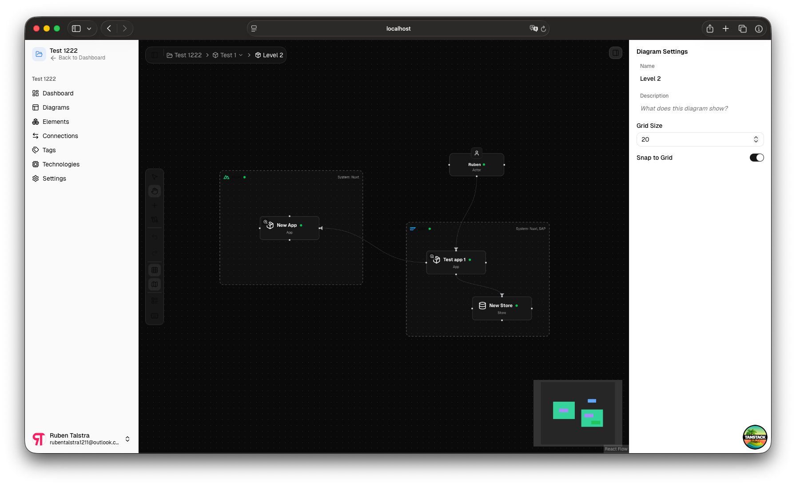
</p>

ArchVault is an open-source, self-hosted platform for modeling software architecture using
the [C4 model](https://c4model.com) (Levels 1-3). Users create systems, diagrams, and reusable architecture blocks
entirely through a visual UI — no code required.

## Features

- **C4 Modeling (L1-L3)** — Context, Container, and Component diagrams with full CRUD
- **Visual Editor** — Interactive canvas powered by React Flow with drag-and-drop, connections, and a properties panel
- **Organizations & Workspaces** — Multi-tenant structure with org-level management
- **Authentication** — Email/password, SSO, two-factor authentication, and SCIM provisioning via Better Auth
- **Role-Based Access Control** — Granular permissions at the organization level
- **Internationalization** — English and Dutch out of the box, powered by Paraglide JS (compile-time, type-safe)
- **Dark & Light Theme** — Automatic theme switching
- **Planned: Blocks Registry** — Save and share reusable architecture blocks with the community

<details> 
<summary><strong>More Screenshots</strong></summary>

<br />

| Dashboard                                          | Workspace                                                    |
|----------------------------------------------------|--------------------------------------------------------------|
| 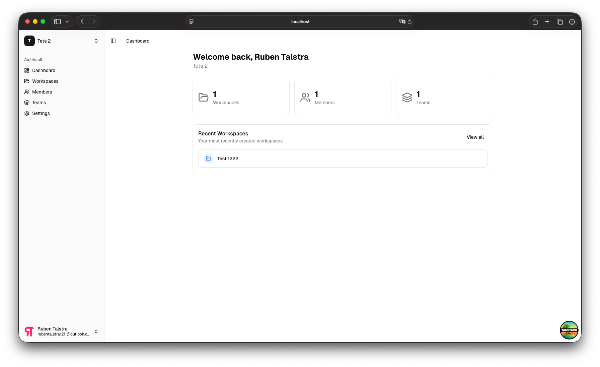 | 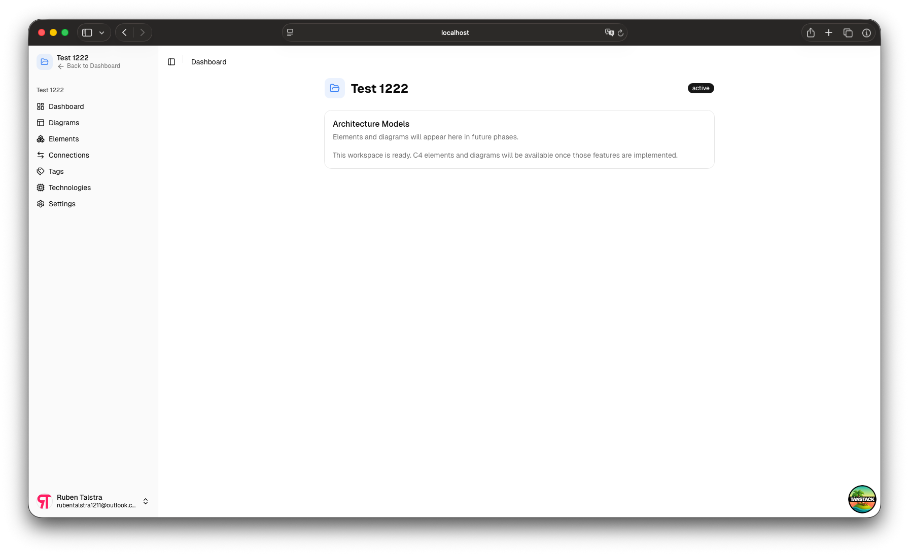 |

| Elements                                         | Connections                                            |
|--------------------------------------------------|--------------------------------------------------------|
| 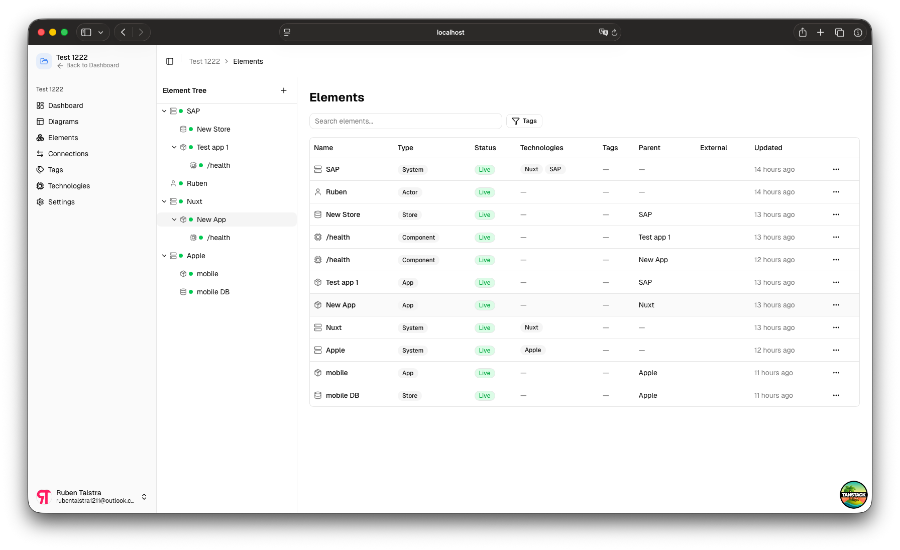 | 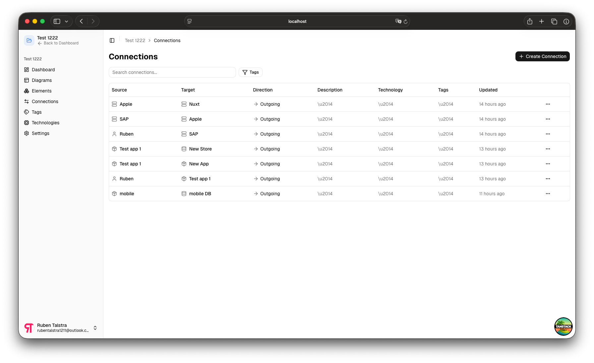 |

| Diagrams                                         | Tags                                     |
|--------------------------------------------------|------------------------------------------|
| 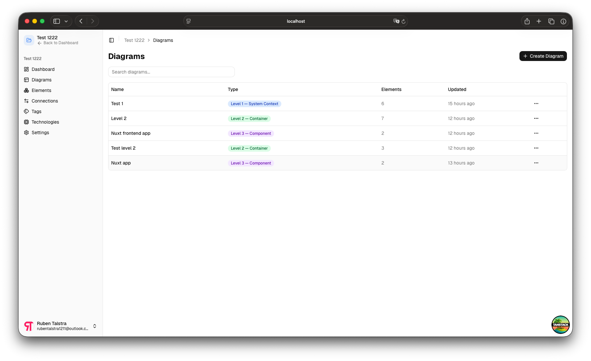 | 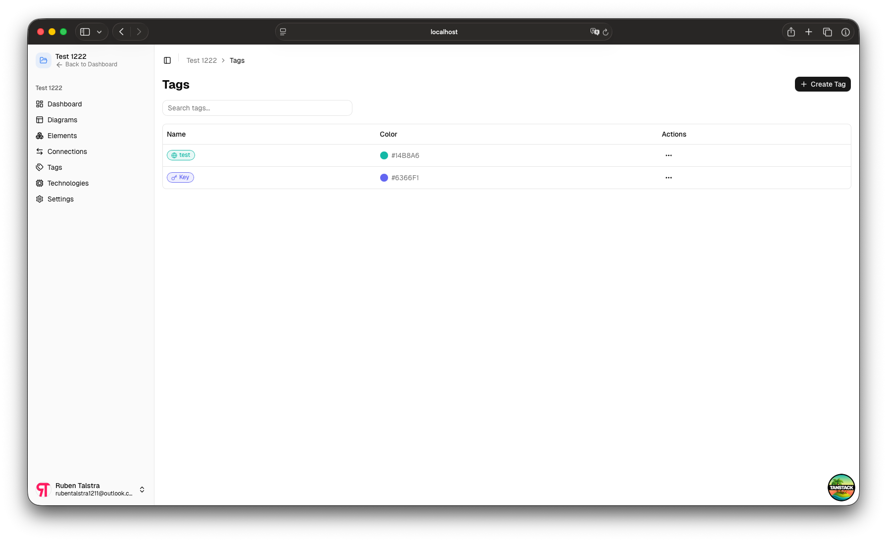 |

| Technologies                                             | Workspace Settings                                         |
|----------------------------------------------------------|------------------------------------------------------------|
| 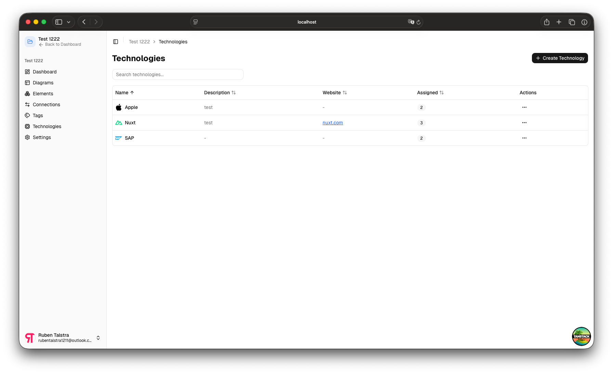 | 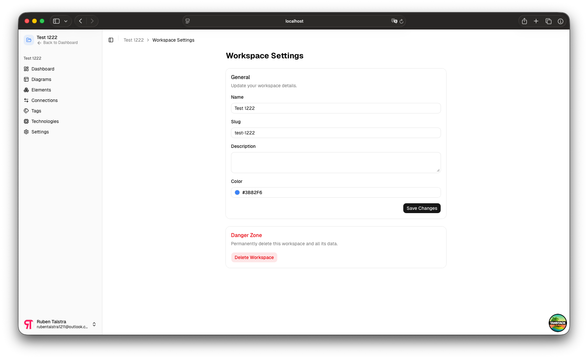 |

| Members                                        | Teams                                      |
|------------------------------------------------|--------------------------------------------|
| 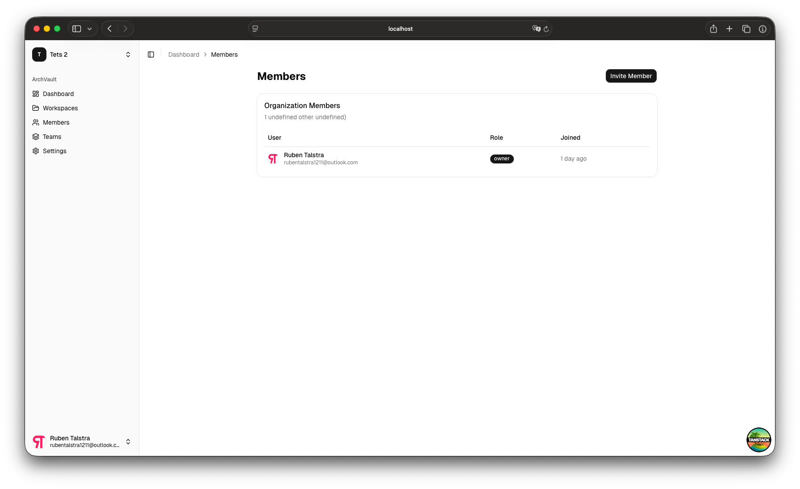 | 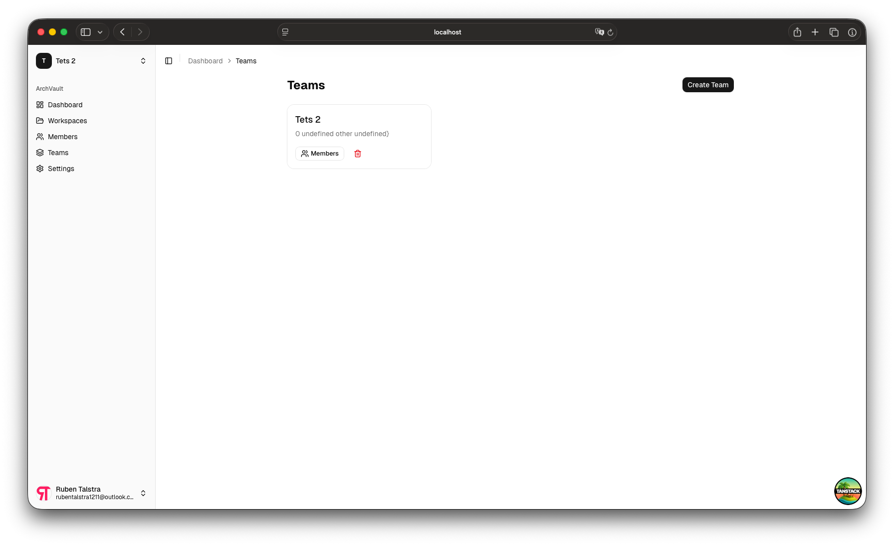 |

**Diagram Editor**

| Level 1 — System Context                                       | Level 2 — Container                                       | Level 3 — Component                                       |
|----------------------------------------------------------------|-----------------------------------------------------------|-----------------------------------------------------------|
| 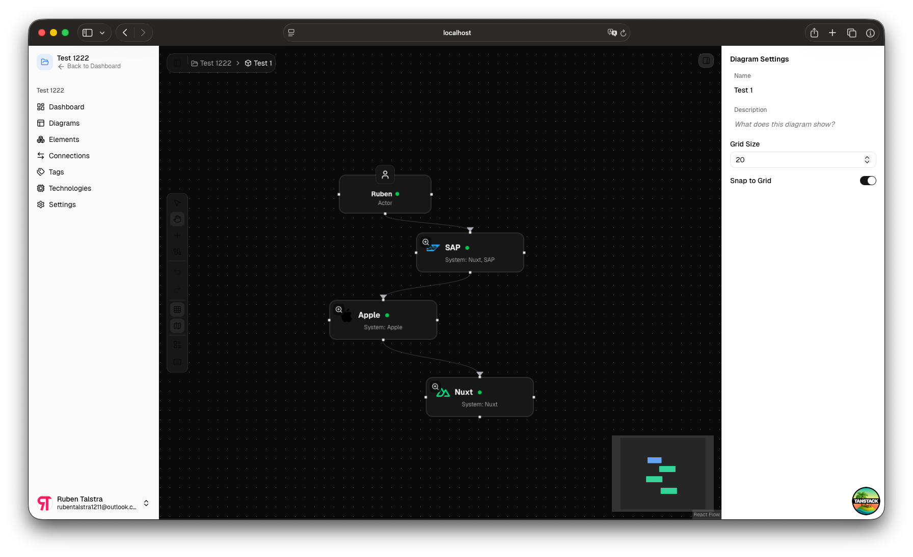 |  | 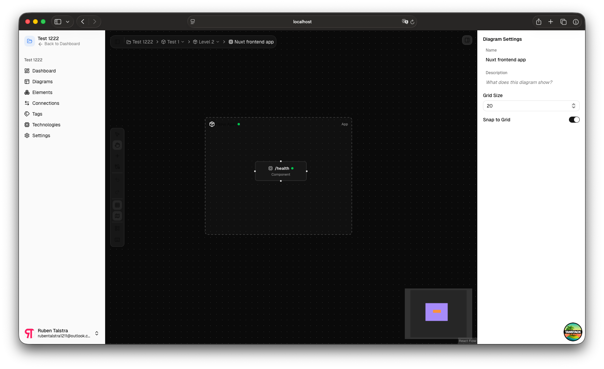 |

> [!NOTE]
> ArchVault is under active development. Features like autosave, keyboard shortcuts, versioning, and a community blocks
> registry are coming soon. See the [Roadmap](#roadmap) for details.

</details>

## Quick Start (Docker Compose)

```bash
git clone https://github.com/rubentalstra/ArchVault.git
cd ArchVault
cp .env.example .env    # Edit with your secrets
docker compose up -d
```

Open [http://localhost:3000](http://localhost:3000).

## Manual Setup

**Prerequisites:** Node.js 24+, pnpm 10+, PostgreSQL 18+

```bash
git clone https://github.com/rubentalstra/ArchVault.git
cd ArchVault
pnpm install
cp .env.example .env    # Configure DATABASE_URL, BETTER_AUTH_SECRET, etc.
pnpm db:migrate
pnpm dev
```

## Tech Stack

| Layer      | Technology                                    |
|------------|-----------------------------------------------|
| Framework  | TanStack Start (React 19 + Nitro)             |
| Router     | TanStack Router (file-based, type-safe)       |
| Data       | TanStack Query, TanStack Form, TanStack Table |
| State      | Zustand                                       |
| Styling    | Tailwind CSS v4                               |
| Components | shadcn/ui (base-nova)                         |
| Auth       | Better Auth (admin, org, SSO, SCIM, 2FA)      |
| Database   | PostgreSQL 18 + Drizzle ORM                   |
| Diagrams   | React Flow                                    |
| i18n       | Paraglide JS v2                               |
| Build      | Vite 8, TypeScript (strict)                   |

## Roadmap

See **[ROADMAP.md](ROADMAP.md)** for the full list of planned features and current progress.

**Completed:** Project scaffold, auth, organizations, workspaces, model objects, connections, tags, diagrams, canvas
editor, autosave, keyboard shortcuts, i18n, Docker setup.

**In progress:** Autosave & keyboard shortcuts UI/UX polish, undo/redo.

**Up next:** Node focus & animation, versions & timeline.

**Future ideas:** Flows & navigation, tech catalog, import/export, blocks registry, community platform.

## Internationalization

ArchVault ships with English (default) and Dutch. Translations are compile-time type-safe
via [Paraglide JS](https://inlang.com/m/gerre34r/paraglide-js). All locales use a URL prefix (`/en/...`, `/nl/...`).

Adding a new locale:

1. Add the locale to `project.inlang/settings.json`
2. Add a URL pattern in `vite.config.ts`
3. Create `messages/{locale}.json`

## Contributing

Contributions are welcome! Please read the [Contributing Guide](CONTRIBUTING.md) before submitting a PR.

## Community

- [GitHub Discussions](https://github.com/rubentalstra/ArchVault/discussions) — Questions, ideas, and general chat
- [Issue Tracker](https://github.com/rubentalstra/ArchVault/issues) — Bug reports and feature requests

## Security

To report a vulnerability, please
use [GitHub Security Advisories](https://github.com/rubentalstra/ArchVault/security/advisories/new) instead of public
issues. See [SECURITY.md](SECURITY.md) for details.

## License

ArchVault is licensed under the [GNU General Public License v3.0](LICENSE).
