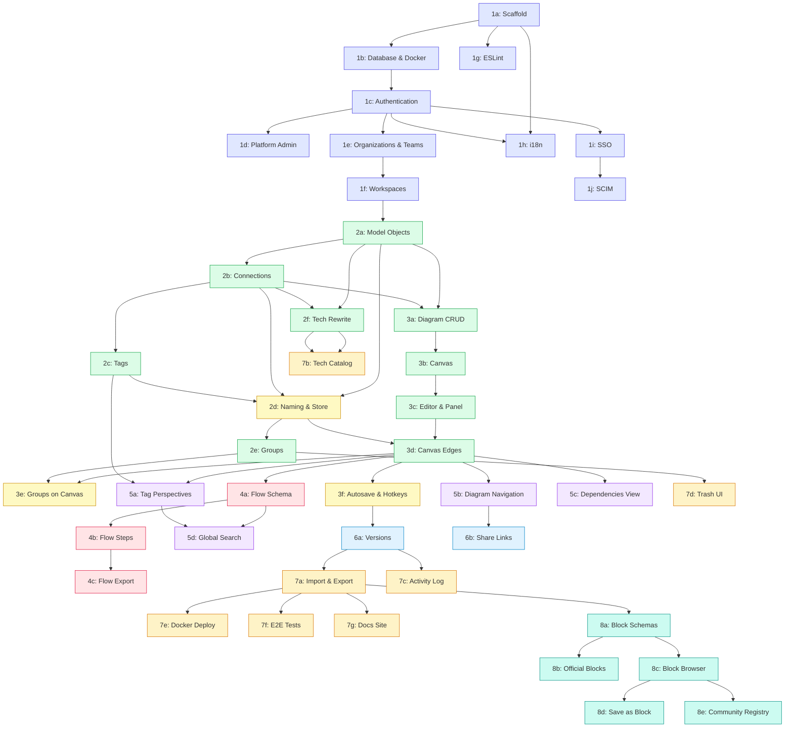

# Archvault — Phase Tracker

Archvault is an open-source visual C4 architecture platform inspired by [IcePanel](https://icepanel.io).
It supports C4 Levels 1–3 (Context, Container/App, Component). Level 4 (Code) is out of scope —
instead, model objects link to source code directly.

## Naming Convention

Archvault uses the same terminology as IcePanel:

| Term         | Description                                                           |
|--------------|-----------------------------------------------------------------------|
| Organization | Top-level billing/team container                                      |
| Workspace    | Contains all model objects, diagrams, flows (= Landscape in IcePanel) |
| Actor        | External user or system actor (C4 "Person")                           |
| System       | Software system (internal or external)                                |
| App          | Deployed/runnable unit within a system (C4 "Container")               |
| Store        | Data store within a system                                            |
| Component    | Building block within an app                                          |
| Group        | Visual overlay around objects in diagrams                             |
| Connection   | Directed link between model objects                                   |
| Tag Group    | Category container for related tags                                   |
| Tag          | Flexible property applied to objects                                  |
| Flow         | Step-by-step sequence across connections                              |
| Version      | Snapshot of workspace state at a point in time                        |

## Progress Overview

| Phase | Title                          | Status      | Dependencies |
|-------|--------------------------------|-------------|--------------|
| 1a    | Project Scaffold               | Complete    | —            |
| 1b    | Database & Docker              | Complete    | 1a           |
| 1c    | Authentication                 | Complete    | 1b           |
| 1d    | Platform Admin                 | Complete    | 1c           |
| 1e    | Organizations & Teams          | Complete    | 1c           |
| 1f    | Workspaces                     | Complete    | 1e           |
| 1g    | ESLint                         | Complete    | 1a           |
| 1h    | Internationalization (i18n)    | Complete    | 1a, 1c       |
| 1i    | SSO (Single Sign-On)           | Complete    | 1c           |
| 1j    | SCIM Provisioning              | Complete    | 1i           |
| 2a    | Model Objects (Elements)       | Complete    | 1f           |
| 2b    | Connections (Relationships)    | Complete    | 2a           |
| 2c    | Tags                           | Complete    | 2b           |
| 2d    | Naming Migration & Store Type  | Not Started | 2a, 2b, 2c   |
| 2e    | Groups                         | Complete    | 2d           |
| 2f    | Technology Rewrite             | Complete    | 2a, 2b       |
| 3a    | Diagram CRUD & Schema          | Complete    | 2a, 2b       |
| 3b    | Canvas Rendering (React Flow)  | Complete    | 3a           |
| 3c    | Editor Interactions & Panel    | Complete    | 3b           |
| 3d    | Canvas Edges & Connections     | Complete    | 3c, 2d       |
| 3e    | Groups on Canvas               | Not Started | 3d, 2e       |
| 3f    | Autosave, Hotkeys & Undo/Redo  | Not Started | 3d           |
| 4a    | Flow Schema & CRUD             | Not Started | 3d           |
| 4b    | Flow Steps & Playback          | Not Started | 4a           |
| 4c    | Flow Export                    | Not Started | 4b           |
| 5a    | Tag Groups & Perspectives      | Not Started | 3d, 2c       |
| 5b    | Multi-Level Diagram Navigation | Not Started | 3d           |
| 5c    | Dependencies View              | Not Started | 3d           |
| 5d    | Global Search                  | Not Started | 4a, 5a       |
| 6a    | Versions & Timeline            | Not Started | 3f           |
| 6b    | Share Links                    | Not Started | 5b           |
| 7a    | Import & Export                | Not Started | 6a           |
| 7b    | Technology Catalog             | Not Started | 2f           |
| 7c    | Activity Log & Audit           | Not Started | 6a           |
| 7d    | Trash UI & Permanent Delete    | Not Started | 2d           |
| 7e    | Docker Self-Hosting            | Not Started | 7a           |
| 7f    | E2E Testing & CI               | Not Started | 7a           |
| 7g    | Documentation Site             | Not Started | 7a           |
| 8a    | Block Schemas & Validation     | Not Started | 7a           |
| 8b    | Official Blocks Library        | Not Started | 8a           |
| 8c    | Block Browser & Install        | Not Started | 8a           |
| 8d    | Save as Block                  | Not Started | 8c           |
| 8e    | Community Registry             | Not Started | 8c           |

## Dependency Graph

**Legend:** Phase 1 (indigo, complete) | Phase 2 (green, mostly complete) | Phase 2d-3f (yellow, in progress / next) |
Phase 4 (rose, flows) | Phase 5 (purple, perspectives & navigation) | Phase 6 (sky, versioning & sharing) | Phase 7 (
amber, platform polish)

## Feature Priority Summary

### Core Loop (Phases 2–3): Model → Diagram → Edit

Build the C4 model, place objects on diagrams, render edges, support groups.

### Visual Storytelling (Phases 4–5): Flows → Perspectives → Navigation

Flows let users walk through use cases step by step. Tag perspectives let different audiences focus on what matters.
Multi-level navigation and dependencies view complete the exploration story.

### Collaboration & History (Phase 6): Versions → Share

Version snapshots track architecture evolution. Share links let anyone explore read-only.

### Platform Polish (Phase 7): Import/Export → Catalog → Deploy → Docs

Round out the platform with data portability, tech catalog, self-hosting, testing, and docs.

### Blocks & Community (Phase 8): Schemas → Library → Registry

Archvault-original feature. Package architecture patterns as reusable blocks. Official blocks provide starter templates.
Community registry lets users publish and install shared blocks.

## Cross-Cutting Concerns

These are NOT separate phases — they are built into every phase:

- **Soft delete:** All entity tables have `deleted_at`. All queries filter `WHERE deleted_at IS NULL`. Implemented from
  phase 2 onwards. Phase 7d adds the trash UI and cleanup.
- **Unit/integration tests:** Written alongside each phase (not deferred to 7f). Phase 7f adds E2E tests.
- **Internationalization:** All user-facing strings use Paraglide `m.key()`. Added in each phase.
- **Permission checks:** All server functions check org role-based permissions. Added in each phase.

## Verification Protocol

After each sub-phase:

1. `pnpm dev` — app starts without errors
2. `pnpm build` — production build succeeds
3. `pnpm test` — all tests pass (including new phase tests)
4. Manual end-to-end verification
5. Update status in this table
