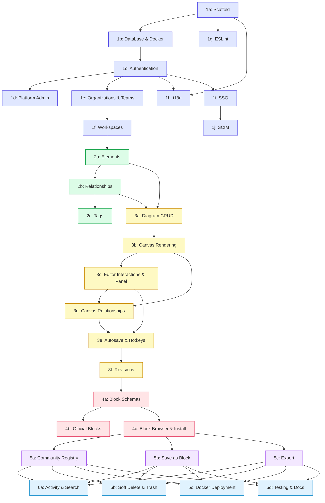

# Archvault — Phase Tracker

## Progress Overview

| Phase | Title                        | Status      | Dependencies | 
|-------|------------------------------|-------------|--------------|
| 1a    | Project Scaffold             | Complete    | —            |
| 1b    | Database & Docker            | Complete    | 1a           |
| 1c    | Authentication               | Complete    | 1b           |
| 1d    | Platform Admin               | Complete    | 1c           |
| 1e    | Organizations & Teams        | Complete    | 1c           |
| 1f    | Workspaces                   | Complete    | 1e           |
| 1g    | ESLint                       | Complete    | 1a           |
| 1h    | Internationalization (i18n)  | Complete    | 1a, 1c       |
| 1i    | SSO (Single Sign-On)         | Complete    | 1c           |
| 1j    | SCIM Provisioning            | Complete    | 1i           |
| 2a    | Elements                     | Complete    | 1f           |
| 2b    | Relationships                | Complete    | 2a           |
| 2c    | Tags                         | Not Started | 2b           |
| 3a    | Diagram CRUD & Schema        | Not Started | 2a, 2b       |
| 3b    | Canvas Rendering             | Not Started | 3a           |
| 3c    | Editor Interactions & Panel  | Not Started | 3b           |
| 3d    | Canvas Relationships         | Not Started | 3b, 3c       |
| 3e    | Autosave, Hotkeys, Undo/Redo | Not Started | 3c, 3d       |
| 3f    | Revisions                    | Not Started | 3e           |
| 4a    | Block Schemas & Validation   | Not Started | 3f           |
| 4b    | Official Blocks              | Not Started | 4a           |
| 4c    | Block Browser & Install      | Not Started | 4a           |
| 5a    | Community Registry           | Not Started | 4c           |
| 5b    | Save as Block                | Not Started | 4c           |
| 5c    | Export                       | Not Started | 4c           |
| 6a    | Activity Log & Search        | Not Started | 5a, 5b, 5c   |
| 6b    | Soft Delete & Trash          | Not Started | 5a, 5b, 5c   |
| 6c    | Docker Deployment            | Not Started | 5a, 5b, 5c   |
| 6d    | Testing & Docs               | Not Started | 5a, 5b, 5c   |

## Dependency Graph

**Legend:** Phase 1 (indigo) | Phase 2 (green) | Phase 3 (yellow) | Phase 4 (rose) | Phase 5 (purple) | Phase 6 (sky)

## Verification Protocol

After each sub-phase:

1. `pnpm dev` — app starts without errors
2. `pnpm build` — production build succeeds
3. Run phase-specific tests
4. Manual end-to-end verification
5. Update status in this table
